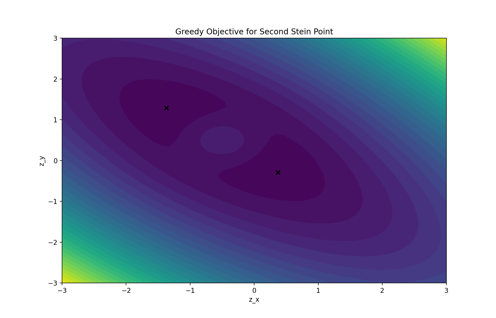

\newpage

# Examples Part 1: Multivariate Normal Distribution with IMQ Kernel

In this section I will work through a few simple examples to clarify my understanding
of the problem.  These will focus on the IMQ kernel and the target distribution will
be the multivariate normal distribution.  The multivariate normal distribution with mean $\mu$
and covariance $\Sigma$ is 
\eq{ p(\mb{z}) = \frac{1}{\sqrt{ \textrm{det}\left( 2 \pi \Sigma \right) }} \, \textrm{exp}\left[ -\frac{1}{2} \transpose{ \left(\mb{z}-\mu\right) }  \Sigma^{-1} \left(\mb{z}-\mu\right) \right] \nonumber }
with corresponding log target $g(\mb{z})$ 
\eq{ g(\mb{z}) = -\frac{1}{2} \textrm{log}\, \left( \textrm{det}\left( 2 \pi \Sigma \right)  \right) -\frac{1}{2} \transpose{ \left(\mb{z}-\mu\right) }  \Sigma^{-1} \left(\mb{z}-\mu\right) \nonumber }
where $\mb{z}\in \mbb{R}^d$ and of course the additive constant can be ignored for our purposes.  The 
IMQ kernel is
\eq{ k(\mb{x},\mb{y}) = \left( \alpha + \|\mb{x}-\mb{y} \|^2 \right)^\beta \nonumber }
with $\alpha>0$ and $-1 < \beta < 0$.

\newpage 

## Example 1.1: Univariate Normal Distribution

In this example I take $d=1$ and investigate:

* What do the KSD and SRK formulas actually look like?
* What kind of objective functions result from the Greedy Minimisation strategy?

With $d=1$ the objective function for the greedy minimisation strategy are easy
to visualise.  This is the univariate normal target $p(x)$. This will be the only case where the bold 
font will not be used for the random variable.  The SRK is 
\eq{  
    k_0(x,y) = \frac{\partial^2 k }{\partial x \partial y} + \pwrt{k}{x} \pwrt{g}{y} +  \pwrt{k}{y} \pwrt{g}{x} + k(x,y)  \pwrt{g}{x} \pwrt{g}{y} 
}
The log gradient for this choice of $p$ is
\eq{
    \pwrt{g}{z} = - (z-\mu)/\Sigma
}
where both $\mu, \Sigma \in \mbb{R}$, and the kernel derivatives are
\eqa{
 \pwrt{k}{x} = & 2 \beta (x-y)  \left( \alpha + \|x-y \|^2 \right) ^{\beta-1}  \nonumber \\
 \pwrt{k}{y} = & -2 \beta (x-y) \left( \alpha + \|x-y \|^2 \right)^{\beta-1} \nonumber \\
 \frac{\partial^2 k }{\partial x \partial y} = & -2 \beta \left( \alpha + \|x-y \|^2 \right)^{\beta-2} \left[ 2(\beta-1)(x - y)^2  
 + \left( \alpha + \|x-y \|^2 \right) \right]
}
The code implementing these formulas is in \verb|stein/notes/learning/mvn/uvn.py|.

\newpage

### Plotting the Greedy Objective

Using the greedy optimisation method (Section 3.1 in Chen Et Al) we set the initial Stein Point to be $x_1=\mu$ ie the distribution mode.
Eventually this will require a global optimisation call but in this simple example lets just assign it.  For each 
subsequent $x_n$ for $n>1$ take $x_n$ to be the value which minimises the objective
\eq{ \mrt{argmin}_z \; \; \left\{ \frac{1}{2}k_0(z,z) + \sum_{j=1}^{n-1}k_0(x_j, z) \right\} }

Since we are in one dimension we can do an exhaustive grid search, and plot the objective function at each iteration 
to get a feel for the minimisation surface.  The script that creates this plot is
\verb|stein/notes/learning/mvn/normal1-1.py|.  Using the log gradient and SRK defined in \verb|uvn.py|
it is simple to write the greedy objective
\plist{}
```Python
def objective(z, ksr, points):
    # evaluate the greedy objective for this point z \in R
    # where points is a sequence of previously computed points
    # use ksr(x,y) to evaluate ksr between any two points
    out = 0.5*ksr(z, z)
    if points is not None:
        for xi in points:
            out += ksr(xi, z)
    return out 
``` 

In the plot below each curve plots the greedy objective for point $x_j$ 
where $j=2,3,\hdots, n$.  No objective is plotted for the initial point but the point itself is plotted in red.
Subsequent Stein Points are plotted in black.  This example would appear to be the *simplest possible example* of the 
computation of Stein Points and yet the scale of the optimisation problem is already apparent.


\newpage

### Plotting Empirical CDFs and Comparing the numpy 

In \verb|/stein/notes/learning/mvn/normal1-2.py| we look at the empirical cdfs.  Running the script produces
output 
\blist{}
```bash
 **** Found Stein Point 2 at z=1.976 after 0:00:00.179566 (H:M:S) **** 
 **** Found Stein Point 3 at z=4.236 after 0:00:00.425367 (H:M:S) **** 
 **** Found Stein Point 4 at z=5.248 after 0:00:00.751985 (H:M:S) **** 
 **** Found Stein Point 5 at z=0.968 after 0:00:01.159569 (H:M:S) **** 
 ...
 ...
 **** Found Stein Point 18 at z=4.420 after 0:00:13.798995 (H:M:S) **** 
 **** Found Stein Point 19 at z=3.304 after 0:00:15.341222 (H:M:S) **** 
 **** Found Stein Point 20 at z=1.568 after 0:00:16.960261 (H:M:S) **** 
 Computation complete.  Found:
  -- 20 Stein Points.
  -- Wall Time: 0:00:16.960291 (H:M:S)
```
for the small $n=20$ case.  Using these samples we compare

* Stein Points
* Two samples of normal rvs generated from \verb|numpy.random.normal|
* True normal CDF

to gain insight into the quality of the convergence of the Stein Point approximation.  I do not know the 
method \verb|numpy| uses to generate normal rvs but I presume it is high quality.  No rigorous testing is
performed but from a cursory look the Stein Points appear to be a highly efficient approximation compared
to the normal rvs generated from \verb|numpy|.


The effectiveness of the Stein Points is even more clear after repeating the experiment with $n=50$. 
\blist{}
```bash
 **** Found Stein Point 2 at z=1.978 after 0:00:00.944684 (H:M:S) **** 
 **** Found Stein Point 3 at z=4.234 after 0:00:02.308628 (H:M:S) **** 
 ...
 ...
 **** Found Stein Point 48 at z=3.438 after 0:09:26.052780 (H:M:S) **** 
 **** Found Stein Point 49 at z=1.642 after 0:09:50.222214 (H:M:S) **** 
 **** Found Stein Point 50 at z=4.417 after 0:10:08.421444 (H:M:S) **** 
Computation complete.  Found:
 -- 50 Stein Points.
 -- Wall Time: 0:10:08.421573 (H:M:S)
```


I note that the greedy objective appears to get progressively slower as we compute more points.  This makes sense
as the objective requires repeated re-calculation of $k_0$ against previous points.  This appears to be 
a possible optimisation strategy for the future.  For example, when we minimize the objective for point $x_2$
we evaluate
\eq{ \frac{1}{2}k_0(z,z) + k_0(x_1, z) \nonumber }
but for each subsequent $x_i$ the expression $k_0(x_1,z)$ will be evaluated again.  It may be faster to 
evaluate $k_0(x_1,z)$ at more points than required by the $2^{\mrt{nd}}$ iteration of the minimiser, but 
save and tabulate them to be interpolated against later.  Further, say $x_{10} \approx x_1$, then can we 
interpolate from $k(x_1,z)$ to $k(x_{10},z)$?

\newpage

### Testing a scipy Global Optimiser

The \verb|scipy| package provides a suite of global optimizers in the \verb|scipy.optimize| namespace.  An
example is the \verb|dual_annealing| routine which is used below.  This routine appears to return essentially
the identical points to the direct search method above, and produces output for $n=20$
\blist{}
```bash
 **** Found Stein Point 2 at z=1.976 after 0:00:00.185857 (H:M:S) **** 
 **** Found Stein Point 3 at z=4.234 after 0:00:00.406755 (H:M:S) **** 
 ...
 ...
 **** Found Stein Point 18 at z=4.414 after 0:00:10.198553 (H:M:S) **** 
 **** Found Stein Point 19 at z=3.300 after 0:00:11.266055 (H:M:S) **** 
 **** Found Stein Point 20 at z=1.562 after 0:00:12.393725 (H:M:S) **** 
Computation complete.  Found:
 -- 20 Stein Points.
 -- Wall Time: 0:00:12.393767 (H:M:S)
```
The resulting ECDF is identical to that produced in the direct search in the line above.


\newpage

## Example 2.1: Bivariate Normal Distribution

Here we continue on from Example 1.1 and compute Stein Points for a multivariate normal in $\mbb{R}^2$.
This is an interesting example for investigating more general formulas for the SRK and log gradients, as
well as how \verb|scipy| routines cope with the nasty optimisation problem in $d=2$.  The SRK is 
\eq{ 
    k_0(\mb{x},\mb{y}) = \sum_{i=1}^{d=2} \left( \frac{\partial^2 k }{\partial x_i \partial y_i} + \pwrt{k}{x_i} \pwrt{g}{y_i} + \pwrt{k}{y_i} \pwrt{g}{x_i} + k (\mb{x}, \mb{y}) \pwrt{g}{x_i} \pwrt{g}{y_i} \right) 
}
the kernel derivatives are
\eqa{
 \pwrt{k}{x_i} = & 2 \beta (x_i-y_i)  \left( \alpha + \|\mb{x}-\mb{y} \|^2 \right) ^{\beta-1}  \nonumber \\
 \pwrt{k}{y_i} = & -2 \beta (x_i-y_i) \left( \alpha + \|\mb{x}-\mb{y} \|^2 \right)^{\beta-1} \nonumber \\
 \frac{\partial^2 k }{\partial x_i \partial y_i} = & -2 \beta \left( \alpha + \|\mb{x}-\mb{y} \|^2 \right)^{\beta-2} \left[ 2(\beta-1)(x_i - y_i)^2  + \left( \alpha + \|\mb{x}-\mb{y} \|^2 \right) \right]
}
and finally the log gradients are 
\eq{ \mb{\nabla} \textrm{log}\,p(\mb{z}) = -\transpose{(\mb{z}-\mu)} \, \inverse{\Sigma} }
These formulas are implemented in \verb|stein/notes/learning/mvn/mvn.py| and are analgous to those computed in 
\verb|uvn.py| discussed previously.  The output is vectorised but the component wise nature of the calculations is clear.

### The d=2 Greedy Objective Function

As one expects the objective function in two dimensions is complicated.  Actually, comparing these to the $d=1$
cases one case see some similarities in shape between the $n=2$ objective in both $d=1$ and $d=2$.  Is this something
to take note of for the future.

The following plot shows contours of the objective for the $n=2$ Stein Point.  This bimodal function looks
analgous to the same curve in $d=1$.  The global minimizer cannot distinguish between minima (they are essentially identical)
but due to symmetry this might be expected and either choice is equally good.  The black dots are the choices made
by multiple runs of the \verb|dual_annealing| routine in \verb|scipy|, where roughly half appear in each minima.




