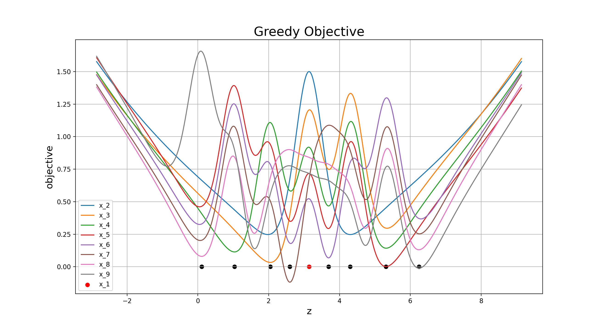

\newpage

## Examples Part 1: Multivariate Normal Distribution with IMQ Kernel

In this section I will work through a few simple examples to clarify my understanding
of the problem.  These will focus on the IMQ kernel and the target distribution will
be the multivariate normal distribution.  The multivariate normal distribution with mean $\mu$
and covariance $\Sigma$ is 
\eq{ p(\mb{z}) = \frac{1}{\sqrt{ \textrm{det}\left( 2 \pi \Sigma \right) }} \, \textrm{exp}\left[ -\frac{1}{2} \transpose{ \left(\mb{z}-\mu\right) }  \Sigma^{-1} \left(\mb{z}-\mu\right) \right] \nonumber }
with corresponding log target $g(\mb{z})$ 
\eq{ g(\mb{z}) = -\frac{1}{2} \textrm{log}\, \left( \textrm{det}\left( 2 \pi \Sigma \right)  \right) -\frac{1}{2} \transpose{ \left(\mb{z}-\mu\right) }  \Sigma^{-1} \left(\mb{z}-\mu\right) \nonumber }
where $\mb{z}\in \mbb{R}^d$ and of course the additive constant can be ignored for our purposes.  The 
IMQ kernel is
\eq{ k(\mb{x},\mb{y}) = \left( \alpha + \|\mb{x}-\mb{y} \|^2 \right)^\beta \nonumber }
with $\alpha>0$ and $-1 < \beta < 0$.

\newpage 

### Example 1.1: Univariate Normal Distribution

In this example I take $d=1$ and investigate:

* What do the KSD and SRK formulas actually look like?
* What kind of objective functions result from the Greedy Minimisation strategy?

With $d=1$ the objective function for the greedy minimisation strategy are easy
to visualise.  This is the univariate normal target $p(x)$. This will be the only case where the bold 
font will not be used for the random variable.  The SRK is 
\eq{  
    k_0(x,y) = \frac{\partial^2 k }{\partial x \partial y} + \pwrt{k}{x} \pwrt{g}{y} +  \pwrt{k}{y} \pwrt{g}{x} + k(x,y)  \pwrt{g}{x} \pwrt{g}{y} 
}
The log gradient for this choice of $p$ is
\eq{
    \pwrt{g}{z} = - (z-\mu)/\Sigma
}
where both $\mu, \Sigma \in \mbb{R}$, and the kernel derivatives are
\eqa{
 \pwrt{k}{x} = & 2 \beta (x-y)  \left( \alpha + \|x-y \|^2 \right) ^{\beta-1}  \nonumber \\
 \pwrt{k}{y} = & -2 \beta (x-y) \left( \alpha + \|x-y \|^2 \right)^{\beta-1} \nonumber \\
 \frac{\partial^2 k }{\partial x \partial y} = & -2 \beta \left( \alpha + \|x-y \|^2 \right)^{\beta-2} \left[ 2(\beta-1)(x - y)^2  + \left( \alpha + \|x-y \|^2 \right) \right]
}
Using the greedy optimisation method (Section 3.1) we set the initial Stein Point to be $x_1=\mu$, the distribution mode.  Eventually this will require a global optimisation call but in this simple example
lets just assign it.  For each subsequent $x_n$ for $n>1$ take $x_n$ to be the value which minimises the objective
\eq{ \mrt{argmin}_z \; \; \left\{ \frac{1}{2}k_0(z,z) + \sum_{j=1}^{n-1}k_0(x_j, z) \right\} }
Since we are in one dimension we can do an exhaustive grid search, and plot the objective 
function at each iteration to get a feel for the minimisation surface.  In the plot below
each curve plots the greedy objective for point $x_j$ where $j=2,3,\hdots, n$.  No objective is plotted
for the initial point but the point itself is plotted in red.  Subsequent Stein Points are 
plotted in black.  This example would appear to be the *simplest possible example* of the 
computation of Stein Points and yet the scale of the optimisation problem is already apparent.

To do:

1. Use the scipy global minimizer -> does it work here?
2. Compute say n=100 points, and compute an empirical distribution.  How does it compare to a sample of 100 points sampled from the true distribution? 

## Next Section

The three derivatives of $k(\mb{x},\mb{y})$ are problem independent (ie do not depend on 
the target required) and are easy to calculate analytically
\eqa{
 \pwrt{k}{x_i} = & 2 \beta (x_i-y_i)  \left( \alpha + \|\mb{x}-\mb{y} \|^2 \right) ^{\beta-1}  \nonumber \\
 \pwrt{k}{y_i} = & -2 \beta (x_i-y_i) \left( \alpha + \|\mb{x}-\mb{y} \|^2 \right)^{\beta-1} \nonumber \\
 \frac{\partial^2 k }{\partial x_i \partial y_i} = & -2 \beta \left( \alpha + \|\mb{x}-\mb{y} \|^2 \right)^{\beta-2} \left[ 2(\beta-1)(x_i - y_i)^2  + \left( \alpha + \|\mb{x}-\mb{y} \|^2 \right) \right]
}